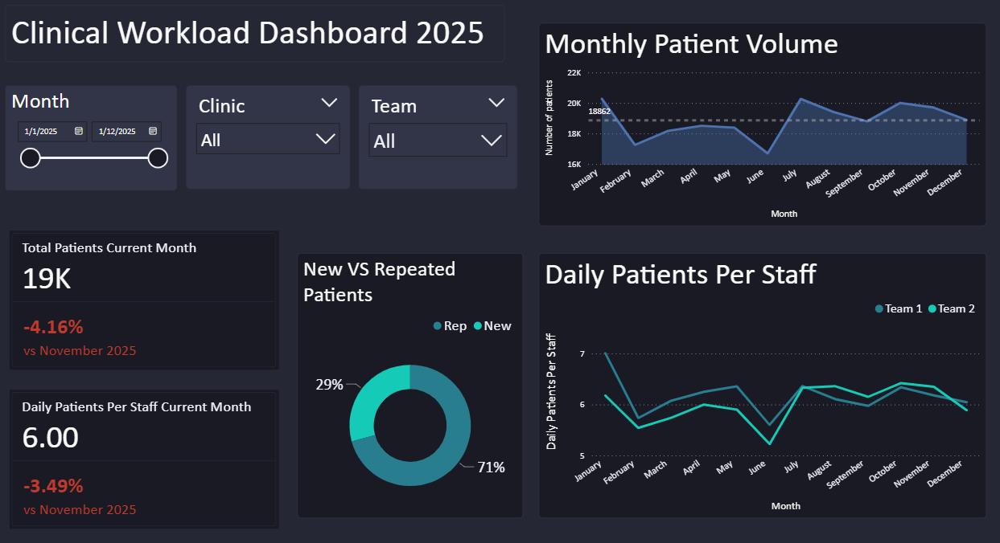

# Workload and Manpower Analysis

This project analyses patient workload and team manpower across clinics, combining **SQL data analysis** with a **Power BI dashboard** for visual insights. It demonstrates an end-to-end workflow: from raw Excel data cleaning, through structured database queries, to interactive visualizations.

---

## 1. Data Preparation

The initial data is stored in Excel files containing patient visit counts and team headcounts by month. The data was cleaned and processed to standardize formats, remove inconsistencies, and prepare it for analysis and visualization.

---

## 2. Database Structure

The cleaned data is loaded into a local SQLite database to allow structured SQL queries, reflecting real-world analysis workflows.  

### Tables

**`workload`** — patient visit counts  

| Column        | Type   | Description                       |
|---------------|--------|-----------------------------------|
| team          | TEXT   | Team identifier (Team 1, Team 2) |
| clinic        | TEXT   | Clinic identifier (A or B)        |
| patient_type  | TEXT   | New or Repeated patient           |
| month         | DATE   | Month of visit (YYYY-MM-01)       |
| patient_count | INTEGER| Number of patient visits           |

**`manpower`** — staff headcount  

| Column    | Type    | Description                     |
|-----------|---------|---------------------------------|
| team      | TEXT    | Team identifier                 |
| month     | DATE    | Month of staffing (YYYY-MM-01) |
| headcount | INTEGER | Number of staff                 |

---

## 3. SQL Analysis

SQL was used to perform structured analysis, highlighting the ability to extract, aggregate, and interpret data before visualizing insights in Power BI.  

### Queries and Insights

1. **Total patient volume by team and clinic**  
   - Team 1 handles 75% of total visits vs. Team 2 (25%)  
   - Clinic A is busier (79% of visits) than Clinic B (21%)  

2. **New vs Repeated patient breakdown**  
   - Team 1 has a higher repeated patient ratio (74.8%)  
   - Team 2 has a more balanced split (58.6% repeated)  

3. **Monthly trends**  
   - Highest patient volume in January, lowest in June  
   - Moderate month-to-month fluctuations indicate cyclical demand  

4. **Patients per staff member**  
   - Team 1: 6.17 patients per staff per working day  
   - Team 2: 6.00 patients per staff per working day  
   - Indicates proportional staffing to demand  

5. **Month-over-month change**  
   - Largest increase: July +21.37%  
   - Largest decline: February -14.92%  
   - Volume fluctuations are cyclical without a directional trend  

> SQL analysis provided structured, quantitative insights into team workloads, patient patterns, and staffing efficiency.

---

## 4. Power BI Dashboard

The Power BI dashboard visualizes trends, comparisons, and efficiencies interactively:

- Monthly patient trends per team
- Patient type distribution
- Staff workload efficiency (patients per staff per month)
- Month-over-month change and growth/decline patterns

**Screenshot of Dashboard:**

> The dashboard allows stakeholders to quickly assess operational efficiency and patient flow visually.

---

## 5. Project Highlights

- Demonstrates **SQL querying and analysis skills**  
- Highlights **data cleaning and preprocessing expertise**  
- Combines analytical results with **visual storytelling in Power BI**  
- Provides a **reproducible workflow** from raw data to insights